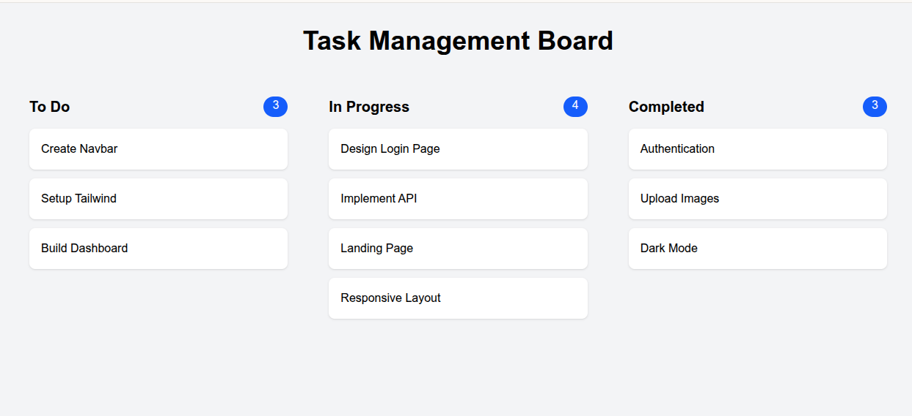

# React DnD Kit Kanban Board


A lightweight, performant drag-and-drop Kanban board application built with React, TypeScript, Vite, and Tailwind CSS. It leverages the powerful `@dnd-kit` library for accessible and robust drag-and-drop interactions.

##  Features

- **Kanban Board Layout**: Three default columns: "To Do", "In Progress", and "Completed".
- **Drag & Drop Reordering**: Rearrange tasks within the same column seamlessly.
- **Cross-Column Movement**: Drag and drop tasks between different status columns to update their progress.
- **Responsive Design**: Built with Tailwind CSS for a modern, responsive layout that works across devices.
- **Type Safety**: Fully typed with TypeScript for reliable development.

## Technologies Used

- **Framework**: [React 19](https://react.dev/)
- **Build Tool**: [Vite](https://vitejs.dev/)
- **Drag & Drop**: [@dnd-kit/core](https://dndkit.com/) & [@dnd-kit/sortable](https://docs.dndkit.com/presets/sortable)
- **Styling**: [Tailwind CSS v4](https://tailwindcss.com/)
- **Language**: TypeScript

## 📦 Getting Started

### Prerequisites

Make sure you have Node.js and npm (or your preferred package manager like yarn/pnpm) installed on your machine.

### Installation

1. Clone this repository (or download the source code).
2. Navigate to the project directory:
   ```bash
   cd react-dnd-kit
   ```
3. Install dependencies:
   ```bash
   npm install
   ```

### Running the Application

To start the development server with Hot Module Replacement (HMR):

```bash
npm run dev
```

The application will be available at `http://localhost:5173`.

### Building for Production

To create a production-ready build:

```bash
npm run build
```

The compiled assets will be placed in the `dist` directory.

## 📁 Project Structure

- `src/App.tsx`: The main application component where the `DndContext` and drag-and-drop logic (handling `onDragEnd`) are configured.
- `src/components/Column.tsx`: The column component that serves as a droppable container for tasks.
- `src/data/tasks.ts`: Contains the initial mock data for the board.
- `src/types/task.ts`: TypeScript interfaces representing the task shapes.

## 🤝 Contributing

Contributions, issues, and feature requests are welcome! Feel free to check the issues page if you want to contribute.
